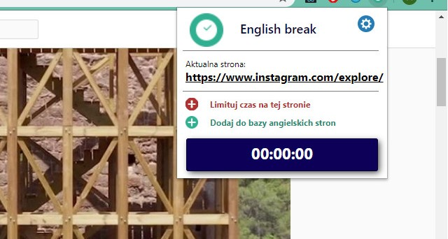

#English break
Ogranicz czas spędzony na portalach społecznościowych i innych pożerających czas stronach 
i wykorzystaj go do nauki angielskiego. 

To rozszerzenie będzie pilnowało czasu spędzonego na blokowanych witrynach i przekieruje cię na stronę z angielską gramatyką.
## Opcje
* Sam decydujesz które witryny pochłaniają najwięcej twojego czasu i blokujesz je.
* Możesz dodać także swoje ulubione strony z których będziesz uszył się angielskiego.
* Ustaw też czas jaki możesz jednorazowo spędzić na blokowanych portalach.

     

## Technologie
JavaScript, HTML, CSS